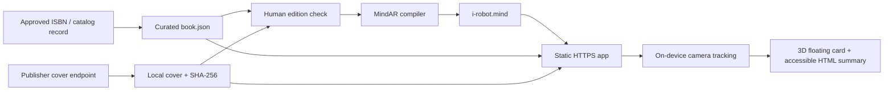

# AR logic

## Why MindAR for this slice

MindAR supports image targets in a static site, needs no project key, and gives this one-cover prototype the smallest deployment surface. The implementation pins MindAR 1.2.5 and A-Frame 1.6.0 locally under `public/vendor/`.

8th Wall is not the fast path it used to be: its hosted platform retired in 2026, while the replacement ecosystem splits between an open-source engine and a separately licensed binary package. The app’s catalog/target boundary is deliberately independent of MindAR, so a later engine adapter can reuse the same approved cover and metadata.

## End-to-end flow

Build-time content acquisition and runtime AR are separate on purpose. The deployed app makes no scraping request and never needs catalog credentials.

## Runtime state machine

| Phase | Trigger | Interface behavior |
| --- | --- | --- |
| `intro` | Page loaded or camera stopped | Shows exact edition and an explicit camera button. |
| `starting` | User selects **Start camera** | Waits for the A-Frame scene, then calls `mindar-image-system.start()`. |
| `scanning` | MindAR emits `arReady` | Shows the cover-shaped guide and scanning status. |
| `tracked` | Target emits `targetFound` | Animates the target-anchored A-Frame card and opens the HTML summary sheet. |
| `lost` | Target emits `targetLost` | Hides the anchored card and briefly asks the user to move back to the cover. |
| `error` | Preflight or MindAR emits an error | Gives a specific recovery message and a no-camera preview. |
| `demo` | User selects the preview path | Simulates the discovered state without claiming that tracking occurred. |

The app does not call `getUserMedia()` separately. MindAR owns the single camera stream. `pagehide` and the exit control stop the tracking system so the browser releases the camera.

## Recognition and presentation

- `public/assets/i-robot-cover.jpg` is the approved, same-origin visual asset.
- `public/assets/i-robot.mind` contains the precomputed feature points for that exact byte sequence.
- `public/data/book.json` connects the record, ISBN, local paths, human-written summary, source URLs, hashes, and compilation time.
- The target-anchored scene displays a floating cover and short summary in 3D.
- The DOM result sheet repeats the summary at normal reading size, remains keyboard accessible, and links to the original SJPL record.

## Add another book

1. Create one manifest entry with a stable internal ID, the exact edition identifiers, a human-written display summary, and provenance.
2. Acquire an approved straight-on cover, decode and visually compare it with the exhibition copy, then store it locally.
3. Compile the image and append it to a multi-target `.mind` file. Record the resulting `targetIndex` beside the book entry.
4. Replace the single `mindar-image-target` entity with one entity per index, or create them from the manifest before the scene starts.
5. Route every entity’s `targetFound` and `targetLost` event through the same state controller with its book ID.
6. Test every physical cover for false positives and for robustness under realistic distance, angle, glare, and library stickers.

For a larger catalog, keep editorial metadata in a build artifact or CMS export. Do not turn the phone client into a live catalog scraper.

## Scraper boundary

The importer uses this trust order:

1. Curated manifest for visible summary and edition selection.
2. Saved-page `Book` JSON-LD for metadata refreshes.
3. A documented publisher ISBN image endpoint for candidate artwork.
4. Manual visual approval before the candidate becomes a tracking target.

It rejects unexpected hosts, protocols, record IDs, ISBNs, MIME types, oversized responses, and cover/target hash mismatches. Open Library is not an automatic fallback: its entry for this ISBN currently shows different artwork, illustrating why ISBN equality alone cannot choose a recognition target.
