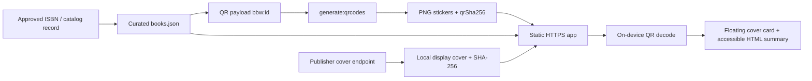

# AR logic

## Why QR codes for this slice

MindAR cover targets were fragile for a library installation: jackets, stickers, glare, and reprint variants all change the trained image. QR stickers keep recognition stable while cover files remain display-only artwork for the result UI.

The scanner prefers the browser `BarcodeDetector` API when it supports `qr_code`, and falls back to jsQR on a center crop of the live camera frame. No project key or hosted AR service is required.

## End-to-end flow

```mermaid
flowchart LR
    A[Approved ISBN / catalog record] --> B[Curated books.json]
    C[Publisher cover endpoint] --> D[Local display cover + SHA-256]
    B --> E[QR payload bbw:id]
    E --> F[generate:qrcodes]
    F --> G[PNG stickers + qrSha256]
    G --> H[Static HTTPS app]
    B --> H
    D --> H
    H --> I[On-device QR decode]
    I --> J[Floating cover card + accessible HTML summary]
```

Build-time content acquisition and runtime scanning are separate on purpose. The deployed app makes no scraping request and never needs catalog credentials.

## Runtime state machine

| Phase | Trigger | Interface behavior |
| --- | --- | --- |
| `intro` | Page loaded or camera stopped | Shows an example title and an explicit camera button. |
| `starting` | User selects **Start camera** | Requests the rear camera via `getUserMedia`. |
| `scanning` | Camera stream is live | Shows the square QR guide and decodes frames. |
| `tracked` | A payload maps to a book id | Swaps in that book’s cover and metadata, unlocks the floating card, and opens the HTML summary sheet. |
| `lost` | No matching QR for ~1s after a hit | Hides the summary briefly and asks the user to move back to the sticker. |
| `error` | Preflight or camera failure | Gives a specific recovery message and a no-camera preview. |
| `demo` | Preview path or `?book=` deep link | Simulates the discovered state without claiming that scanning occurred. |

`pagehide` and the exit control stop the scan loop and release camera tracks.

## Recognition and presentation

- `public/data/books.json` assigns every book a stable ID, contiguous `targetIndex`, and `qrPayload` (`bbw:` + id).
- `public/assets/qrcodes/*.png` are the printable targets; their SHA-256 values are recorded in each book’s provenance.
- Cover JPEGs under `public/assets/` are for the intro, floating card, and result UI only.
- Target 0 is the approved *I, Robot* edition metadata. Targets 1–4 remain edition candidates until checked against the physical books.
- `/print-qrcodes.html` lays out all stickers for library printing.

## Add another book

1. Create one manifest entry with a stable internal ID, the next contiguous target index, exact edition identifiers, a human-written display summary, and provenance.
2. Acquire a display cover for the UI and store it locally.
3. Run `npm run generate:qrcodes` so the new id receives a PNG and `qrPayload`.
4. Print the new sticker and place it on or beside the exhibition copy.
5. Test scanning under realistic distance, angle, and lighting.

For a larger catalog, keep editorial metadata in a build artifact or CMS export. Do not turn the phone client into a live catalog scraper.

## Scraper boundary

The importer uses this trust order:

1. Curated manifest for visible summary and edition selection.
2. Saved-page `Book` JSON-LD for metadata refreshes.
3. A documented publisher ISBN image endpoint for candidate display artwork.
4. Manual visual approval before treating edition metadata as installation-ready.

It rejects unexpected hosts, protocols, record IDs, ISBNs, MIME types, oversized responses, and QR hash mismatches. Open Library is not an automatic fallback for recognition: ISBN equality alone never chooses a scan target now that QR payloads own that role.
