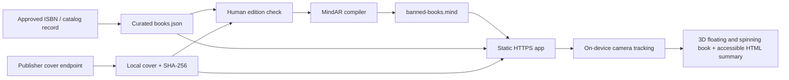

# AR logic

## Why MindAR for this slice

MindAR supports image targets in a static site, needs no project key, and gives this one-cover prototype the smallest deployment surface. The implementation pins MindAR 1.2.5 and A-Frame 1.6.0 locally under `public/vendor/`.

8th Wall is not the fast path it used to be: its hosted platform retired in 2026, while the replacement ecosystem splits between an open-source engine and a separately licensed binary package. The app’s catalog/target boundary is deliberately independent of MindAR, so a later engine adapter can reuse the same approved cover and metadata.

## End-to-end flow

```mermaid
flowchart LR
    A[Approved ISBN / catalog record] --> B[Curated books.json]
    C[Publisher cover endpoint] --> D[Local cover + SHA-256]
    B --> E[Human edition check]
    D --> E
    E --> F[MindAR compiler]
    F --> G[banned-books.mind]
    G --> H[Static HTTPS app]
    B --> H
    D --> H
    H --> I[On-device camera tracking]
    I --> J[3D floating and spinning book + accessible HTML summary]
```

Build-time content acquisition and runtime AR are separate on purpose. The deployed app makes no scraping request and never needs catalog credentials.

## Runtime state machine

| Phase | Trigger | Interface behavior |
| --- | --- | --- |
| `intro` | Page loaded or camera stopped | Shows exact edition and an explicit camera button. |
| `starting` | User selects **Start camera**, or opens a valid `?book=` QR link | Waits for the A-Frame scene, then calls `mindar-image-system.start()` and requests camera access. |
| `scanning` | MindAR emits `arReady` | Shows the cover-shaped guide and searches all eighteen compiled targets, with a throttled QR fallback. |
| `tracked` | A target emits `targetFound`, or a sticker is decoded | Cover matches attach the spinning 3D book to the physical anchor. QR matches show a spinning book in the camera overlay. Both open the HTML summary sheet. |
| `lost` | Target emits `targetLost` | Hides the anchored book and briefly asks the user to move back to the cover. |
| `error` | Preflight or MindAR emits an error | Gives a specific recovery message and a no-camera preview. |
| `demo` | User explicitly selects a book preview | Shows the spinning book without opening the camera, labeled as a preview. |

A valid QR deep link keeps its book selected during camera startup. When MindAR emits `arReady`, that book is immediately presented over the live camera feed with its summary, and both QR and cover recognition remain active. Camera errors offer **Start AR** for the selected book and an explicit **View book preview** fallback. A bare homepage or an unknown book ID does not automatically open the camera.

The app does not call `getUserMedia()` separately. MindAR owns the single camera stream. `pagehide` and the exit control stop the tracking system so the browser releases the camera.

## Recognition and presentation

- `public/data/books.json` assigns every book a stable ID and contiguous `targetIndex`.
- `public/assets/banned-books.mind` contains all eighteen covers in the exact order recorded by the manifest.
- Each manifest entry connects its record, ISBN, local cover, summary, source URLs, review state, hashes, and compilation time.
- Target 0 is the approved *I, Robot* cover. Targets 1–17 are explicit edition candidates until checked against the physical books.
- The target-anchored scene displays a floating 3D book with a six-second rotation. The HTML result sheet displays the summary, remains keyboard accessible, and links to the SJSU King Library OneSearch catalog.
- The shared A-Frame entity stays in the scene DOM. Its Three.js object is attached to the matching anchor; reparenting the DOM entity tears down its components and can leave the reveal animation at an invisible scale.
- A cover match owns the result while its anchor is visible. QR detection pauses during cover tracking; otherwise, reads run sequentially at least 250 milliseconds apart. Stopped scan sessions ignore late QR results.

### Cover quality audit (October 5, 2026)

The real detector matched 16 of the 18 configured reference images in a 640 × 960 test camera feed. This validates the saved images, not the editions currently on display. The current *Ulysses* image has very few stable tracking points; the *Dialogue Concerning Two New Sciences* image is a nearly blank cloth binding with no usable points at one tracking scale. Both failed that audit and need clearer reference photos of their exhibition copies (or distinctive title pages) before cover scanning can be considered reliable. Their existing QR stickers still work.

## Add another book

1. Create one manifest entry with a stable internal ID, the next contiguous target index, exact edition identifiers, a human-written display summary, and provenance.
2. Acquire an approved straight-on cover, decode and visually compare it with the exhibition copy, then store it locally.
3. Compile the image and append it to a multi-target `.mind` file. Record the resulting `targetIndex` beside the book entry.
4. Add one `mindar-image-target` anchor with the same index. The shared book’s Three.js object attaches to whichever anchor matches, without moving its DOM entity.
5. Route every entity’s `targetFound` and `targetLost` event through the shared state controller.
6. Test every physical cover for false positives and for robustness under realistic distance, angle, glare, and library stickers.

For a larger catalog, keep editorial metadata in a build artifact or CMS export. Do not turn the phone client into a live catalog scraper.

## Scraper boundary

The importer uses this trust order:

1. Curated manifest for visible summary and edition selection.
2. Saved-page `Book` JSON-LD for metadata refreshes.
3. A documented publisher ISBN image endpoint for candidate artwork.
4. Manual visual approval before the candidate becomes a tracking target.

It rejects unexpected hosts, protocols, record IDs, ISBNs, MIME types, oversized responses, and cover/target hash mismatches. Open Library is not an automatic fallback: its entry for this ISBN currently shows different artwork, illustrating why ISBN equality alone cannot choose a recognition target.
